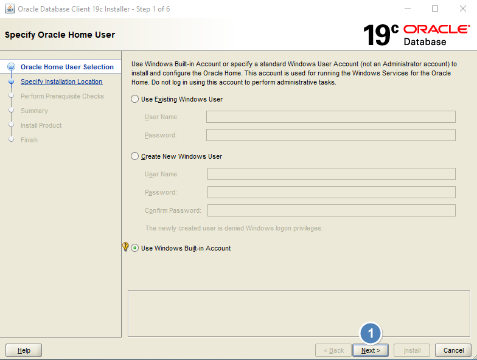
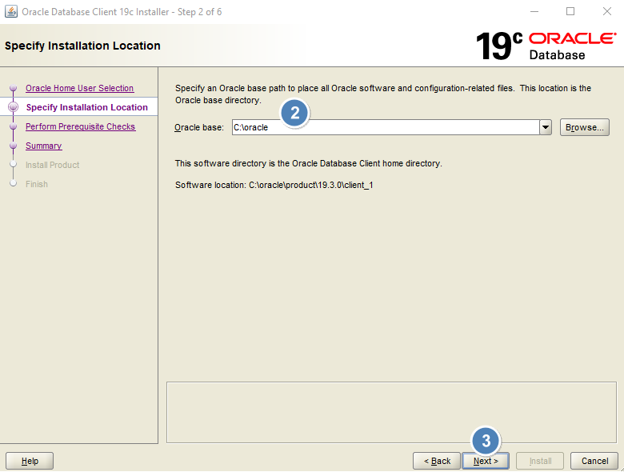
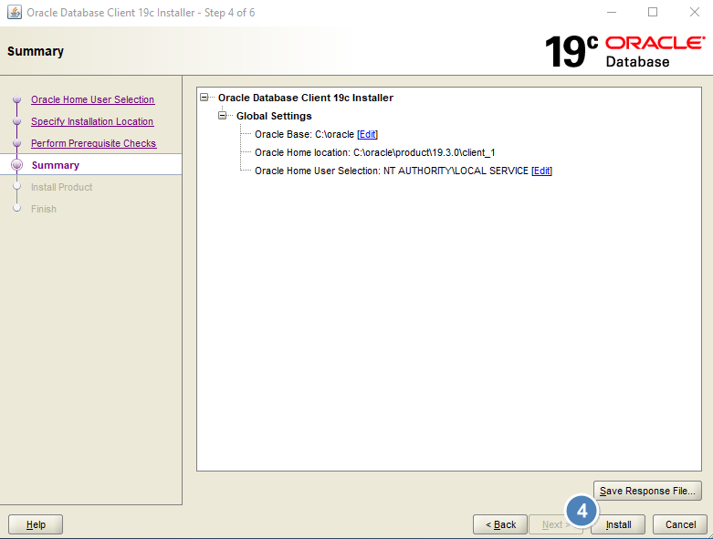
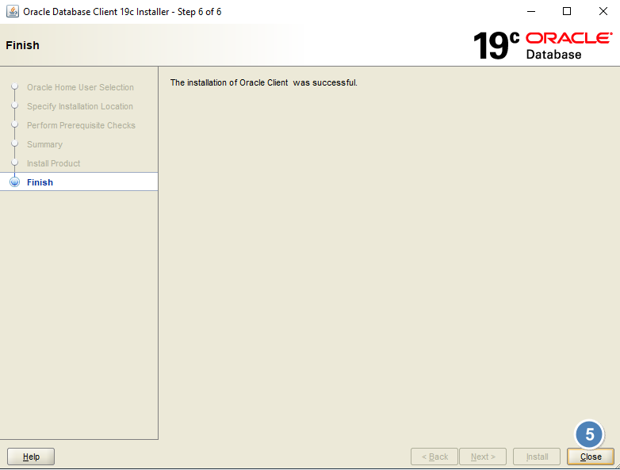
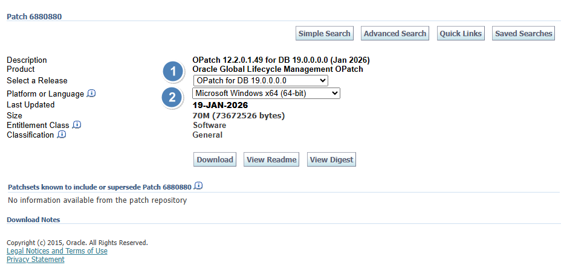

# Instalação do Oracle Client 19.X Windows X64


<br><br>
## Índice
- [Disclaimer](#disclaimer)
- [Baixar o software do Oracle Full Client para Windows](#baixar-o-software-do-oracle-full-client-para-windows)
- [Estrutura de pastas OFA-Compliance para instalação do Oracle Full Client para Windows](#estrutura-de-pastas-ofa-compliance-para-instalação-do-oracle-full-client-para-windows)
- [Instalando o Oracle Full Client para Windows](#instalando-o-oracle-full-client-para-windows)
- [Atualizar o OPatch (aplicativo atualizador/aplicador de patch Oracle)](#atualizar-o-opatch-aplicativo-atualizadoraplicador-de-patch-oracle)
- [Criar a variavel de ambiente TNS_ADMIN e configurar os arquivos tnsnames.ora e sqlnet.ora do Net Manager](#criar-a-variavel-de-ambiente-tns_admin-e-configurar-os-arquivos-tnsnamesora-e-sqlnetora-do-net-manager)
- [Carregar a variavel de ambiente TNS_ADMIN e testar a conexão com o client](#carregar-a-variavel-de-ambiente-tns_admin-e-testar-a-conexão-com-o-client)


<br><br>
### Disclaimer
Esse manual segue praticadas definidas no modelo (Oracle OFA) O Oracle Optimal Flexible Architecture, que  é um conjunto de diretrizes de configuração e estrutura de diretórios, recomendado pela Oracle para organizar instalações de bancos de dados e clients.  
Ele padroniza o armazenamento de arquivos (binários, dados, logs) para facilitar a administração, performance e coexistência de múltiplos bancos e clients.  
https://docs.oracle.com/en/database/oracle/oracle-database/19/ladbi/optimal-flexible-architecture.html  
Para o nosso caso, faz-se necessária a criação  da seguinte estrutura para adequação ao **OFA para Oracle Database Full Cient for Windows X64**

**Variaveis de ambiente dinâmicas do client e seus apontamentos de pastas no Sistema Operacional**
- ORACLE_BASE = C:\oracle
- ORACLE_HOME = C:\oracle\product\19.3.0\client_1

**Variaveis de ambiente globais do Sistema Operacional**
- PATH = C:\oracle\product\19.3.0\client_1\bin
- TNS_ADMIN = C:\oracle\product\19.3.0\client_1\network\admin


<br><br>
### Baixar o software do Oracle Full Client para Windows
Baixar o software do Oracle Full Client para Windows pesquisando por "Oracle Database <Verssão do DB> Client <versão: exemplo (19.3)> for Microsoft Windows x64 (64-bit)".  
No nosso caso "Oracle Database 19c Client (19.3) for Microsoft Windows x64 (64-bit)", baixar a versão com "home".  
Arquivo "**WINDOWS.X64_193000_client_home.zip**"

Ao clicar em download será direcionado para uma tela de login.   
>[!NOTE]
>
>**É necessário logar com uma conta Oracle**
<br>
Será baixado o arquivo da instalação do client, algo como "WINDOWS.X64_193000_client_home.zip"


<br><br>
### Estrutura de pastas OFA-Compliance para instalação do Oracle Full Client para Windows
Invocar o Power Shell como administrador para executar os seguintes comandos de criação de pastas de acordo com o modelo para Oracle Full Client.  
<br>
**Criar as pastas da estrutura OFA que contém o ORACLE_BASE e ORACLE_HOME**
```powershell
mkdir -p C:\oracle\product\19.3.0\client_1
```

**Sintaxe do comando para desconpactação do arquivo zip com a instalação do client baixado na pasta padrão de downloads do usuário corrente**
```powershell
Expand-Archive -Path "C:\Users\<usuario SO>\Downloads\WINDOWS.X64_193000_client_home.zip" `
               -DestinationPath "C:\oracle\product\19.3.0\client_1" `
               -Force
```


<br><br>
### Instalando o Oracle Full Client para Windows

**Ainda no promt do Power Shell como administrador, executar os seguintes comandos para iniciar a instalação**  
<br>
Acessar a pasta do client.
```powershell
cd C:\oracle\product\19.3.0\client_1
```

Executar o comando do instalador.
```powershell
.\setup.bat
```

Na primeira tela "Specify Oracle Home User" do instalador, deixar marcada a opção "Use Windows Built-in Account" e clicar em "Next".



Na tela seguinte "Specify installation location" informar o caminho da ORACLE_BASE, no nosso caso "C:\oracle" e clciar em "Next".



E na ultima tela antes da instalação "Summary", conferir os valores listados de acordo com o disclaimer inicial e clicar em "Install".



Na tela "Finish" clicar em "Close" (não fechar o Prompt do Power Shell)




<br><br>
### Atualizar o OPatch (aplicativo atualizador/aplicador de patch Oracle)

**Identificar a versão atual do OPatch**  
<br>
Executar o comando
```powershell
C:\oracle\product\19.3.0\client_1\OPatch\.\opatch.bat version
```

Deverá aprecer algo como:  
OPatch Version: 12.2.0.1.15  
OPatch succeeded.

**Acessar o site de atualização do OPatch - https://updates.oracle.com/download/6880880.html.**
>[!NOTE]
>
>**É necessário logar com uma conta Oracle**

Na tela de escolha do Patch selecione as seguintes opções:  
1. "Select a Release" escolher "OPatch for DB 19.0.0.0.0",
2. "Platform or Language" escolher "Microsoft Windows x64 (64-bit)"

Clicar em "Download", será baixado o arquivo da atualização do OPatch, algo como "**p6880880_190000_MSWIN-x86-64.zip**"



No prompt do Power Shell como administrador executar os seguintes comandos para fazer um backup do OPatch atual.
```powershell
Rename-Item "C:\oracle\product\19.3.0\client_1\OPatch" "OPatch_old"
```

Comando para descompactação do arquivo zip com a atualização do OPatch baixado a partir da pasta padrão de downloads do usuário corrente
```powershell
Expand-Archive -Path "C:\Users\usuario SO\Downloads\p6880880_190000_MSWIN-x86-64.zip" `
               -DestinationPath "C:\oracle\product\19.3.0\client_1" `
               -Force
```

Executar novamente o comando para verificar se a nova versão foi instalada corretamente.
```powershell
C:\oracle\product\19.3.0\client_1\OPatch\.\opatch.bat version
```

Deverá aprecer algo como:  
OPatch Version: 12.2.0.1.49  
OPatch succeeded.


<br><br>
### Criar a variavel de ambiente TNS_ADMIN e configurar os arquivos tnsnames.ora e sqlnet.ora do Net Manager  
Criar a variável de ambiente TNS_ADMIN com o caminho onde serão criados os arquivos tnsnames.ora e sqlnet.ora.
```powershell
[Environment]::SetEnvironmentVariable(
  "TNS_ADMIN",
  "C:\oracle\product\19.3.0\client_1\network\admin",
  "Machine"
)
```

Criar os arquivos tnsnames.ora e sqlnet.ora na pasta TNS_ADMIN.
>[!IMPORTANT]
>
>**Atenção ao apontamento correto do HOST e do Service_Name.**  

Acessar a pasta onde serão serão criados os arquivos

```powershell
cd C:\oracle\product\19.3.0\client_1\network\admin
```

**Criação do arquivo tnsnames.ora**
```powershell
$conteudo = @"
<alias 1> =
  (DESCRIPTION =
      (ADDRESS = (PROTOCOL = TCP)(HOST = <Host IP/DNS>)(PORT = 1521))
    (CONNECT_DATA =
      (SERVICE_NAME = <service name/pdb/SID>)
    )
  )

<alias 2> =
  (DESCRIPTION =
      (ADDRESS = (PROTOCOL = TCP)(HOST = <Host IP/DNS>)(PORT = 1521))
    (CONNECT_DATA =
      (SERVICE_NAME = <service name/pdb/SID>)
    )
  )
"@

Set-Content -Path "C:\oracle\product\19.3.0\client_1\network\admin\tnsnames.ora" -Value $conteudo -Encoding ASCII
```

**criação do arquivo sqlnet.ora**
```powershell
$conteudo = @"
SQLNET.AUTHENTICATION_SERVICES= (NTS)

NAMES.DIRECTORY_PATH= (TNSNAMES, EZCONNECT)
"@

Set-Content -Path "C:\oracle\product\19.3.0\client_1\network\admin\sqlnet.ora" -Value $conteudo -Encoding ASCII
```


<br><br>
### Carregar a variavel de ambiente TNS_ADMIN e testar a conexão com o client

Carregar a variável TNS_ADMIN na sessão atual para evitar fechar o Power Shell.
```powershell
$env:TNS_ADMIN = [Environment]::GetEnvironmentVariable("TNS_ADMIN", "Machine")
```

Carregar o PATH na sessão atual para evitar fechar o Power Shell.
```powershell
$env:PATH = [Environment]::GetEnvironmentVariable("Path", "Machine")
```

Testar a conexão com o comando.
```powershell
sqlplus c##<usuario>@sigrh.intralesc.sc.gov.br
```
